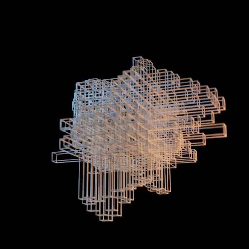

# Organic morphology

Blender Python procedural animation.

Concepts:
* Python API is used for vertex animation.
  * Proportional extrusion via kd tree and bell shape functions.
* Subidvision surface or remesh modifier for mesh smoothing (relaxation)

Artwork and videos: https://www.artstation.com/artwork/LR8JVR

<table>
<tr>
  <td></td>
  <td></td>
  <td></td>
</tr>
</table>

<table>
<tr>
  <td></td>
  <td></td>
</tr>
</table>

